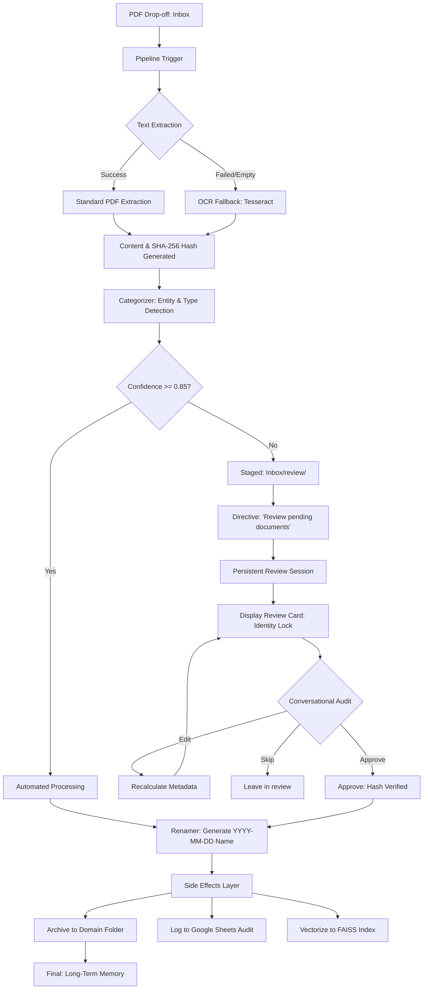

# IDMS Document Management Flowchart (v12)

This diagram illustrates the end-to-end lifecycle of a document within the Intelligent Document Management System, including the **Real OCR Fallback** and **Natural Language Review** paths.

## Key Architectural Components
1. **Extraction Layer**: Dual-mode extraction (Native + OCR) with deterministic SHA-256 hashing.
2. **Confidence Gating**: 0.85 safety threshold to prevent misclassification.
3. **Conversational Review**: Persistent session management with binary hash integrity locks.
4. **Permanent Storage**: Domain-driven archival in G-Drive (`06-long-term-memory`).
